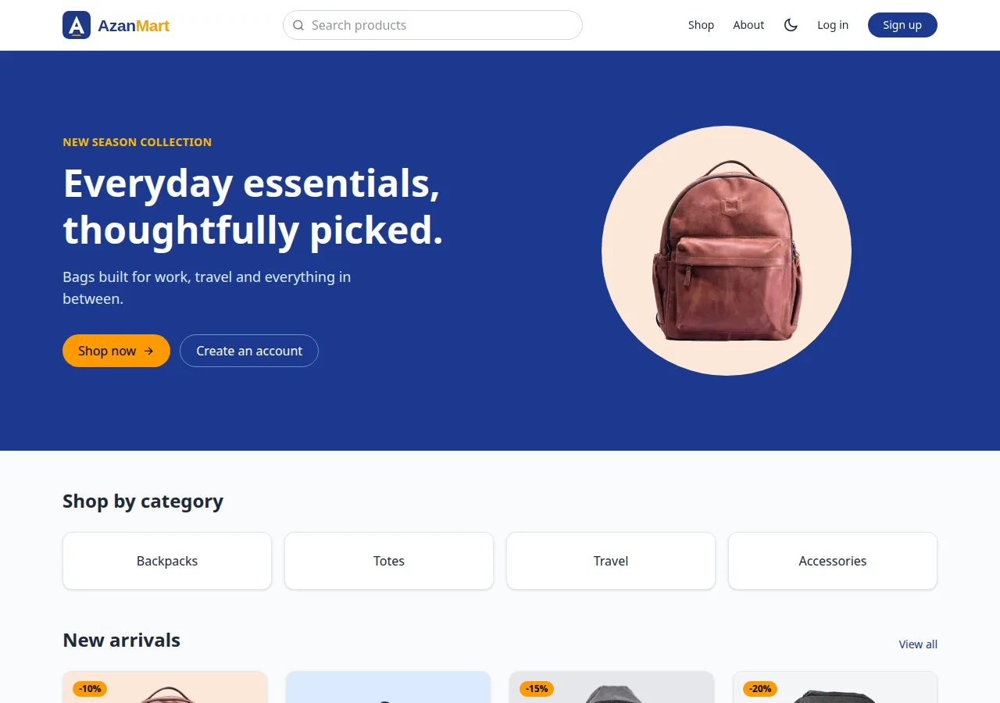
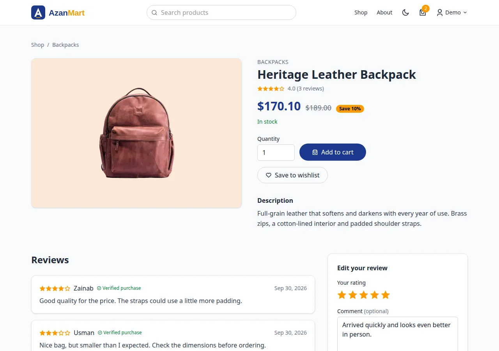
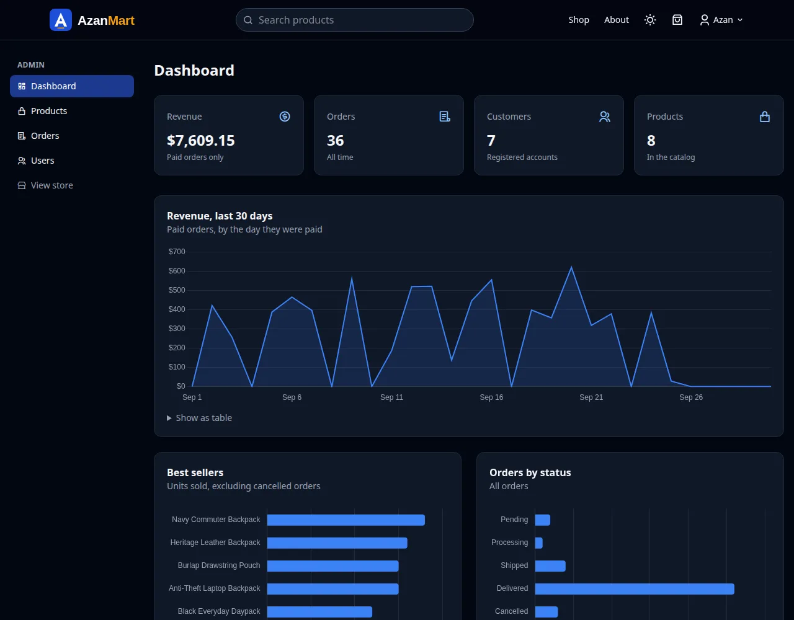
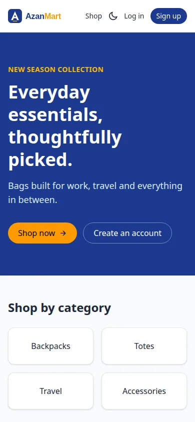
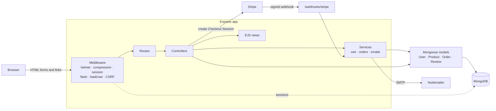

# AzanMart

> Everyday essentials, thoughtfully picked.

[](https://github.com/Azan-imtiaz/AzanMart/actions/workflows/ci.yml)


AzanMart is a full-stack online store rendered on the server with **Node.js, Express 5, EJS and MongoDB**.
Shoppers can search the catalog, save favourites, check out with Stripe or cash on delivery and track
their orders. Admins get a dashboard with sales charts and tools to manage products, orders and users.

Designed and developed by **Azan Imtiaz** · [GitHub](https://github.com/Azan-imtiaz) · [LinkedIn](https://www.linkedin.com/in/azan-imtiaz)

**Live demo:** _coming soon_ (see [Deploying](#deploying) to run your own)



## Try the demo

After running `npm run seed`, you can log in with:

| Role     | Email                | Password      |
| -------- | -------------------- | ------------- |
| Admin    | `admin@azanmart.dev` | `Admin@12345` |
| Customer | `demo@azanmart.dev`  | `Demo@12345`  |

Card payments use Stripe test mode: card `4242 4242 4242 4242`, any future date, any CVC.

### Stripe and Gmail are optional

AzanMart runs without any Stripe or Gmail keys, but a few features are limited until you add them:

| Feature                    | Without the keys                                                                                                                                    | With the keys                                                          |
| -------------------------- | --------------------------------------------------------------------------------------------------------------------------------------------------- | ---------------------------------------------------------------------- |
| **Card payments (Stripe)** | Only **cash on delivery** is offered at checkout; the card option is hidden                                                                         | Shoppers can pay by card on Stripe's secure page, confirmed by webhook |
| **Emails (Gmail)**         | Nothing is sent. Each email (verification codes, order updates, password resets) is saved as an HTML file and its path is printed in the server log | Real emails reach the shopper's inbox                                  |
| **New account sign-up**    | The 6-digit verification code has to be read from the server log (the seeded demo accounts are already verified)                                    | The code arrives by email                                              |

Everything else (browsing, search, cart, wishlist, reviews, cash-on-delivery orders, the admin
dashboard) works the same either way.

**To see every feature working, add your own keys** to `.env` (copy `.env.example` first):

- **Stripe:** create a free account and copy your **test** secret key into `STRIPE_SECRET_KEY`
  (and a webhook secret into `STRIPE_WEBHOOK_SECRET`). Test mode never charges real money.
- **Gmail:** turn on 2-Step Verification, create an App Password and set `SMTP_USER` and `SMTP_PASS`.

Step-by-step instructions for both are in [docs/DEPLOYMENT.md](docs/DEPLOYMENT.md#4-turn-on-card-payments-optional).
Use your own accounts: keys are never included in this repository.

## Screenshots

| Shop with filters                   | Product page with reviews                 |
| ----------------------------------- | ----------------------------------------- |
|  |  |

| Cart                                | Checkout                                    |
| ----------------------------------- | ------------------------------------------- |
|  |  |

| Admin dashboard                                 | Dark mode                                                |
| ----------------------------------------------- | -------------------------------------------------------- |
|  |  |

| Order management                              | Mobile                                                            |
| --------------------------------------------- | ----------------------------------------------------------------- |
|  |  |

## Features

**For shoppers**

- Full-text search, category, price, sale and stock filters, sorting and pagination
- Product pages with an image gallery, stock status, related products and reviews with verified-purchase badges
- Cart with quantities and live stock checks, plus a wishlist
- Checkout with **Stripe** (hosted payment page) or **cash on delivery**
- Email verification with a 6-digit code before the first order
- Order history with a delivery timeline, courier and tracking number
- Emails from Gmail (or any SMTP provider) when an order is confirmed, shipped, delivered or cancelled
- Account settings and password reset by email
- Dark mode, keyboard-friendly markup and a layout that works from 320px up

**For admins**

- Dashboard with revenue, orders by status and best sellers (Chart.js)
- Create, edit and delete products; uploads are resized and converted to WebP
- Filter orders and move them through pending → processing → shipped → delivered (or cancelled, which restocks)
- List customers with their order totals and change roles

**Under the hood**

- Server-side rendering with SEO built in: per-page meta and Open Graph tags, `sitemap.xml`, `robots.txt` and schema.org Product data
- Sessions stored in MongoDB, CSRF tokens on every form, Helmet with a strict Content Security Policy, rate-limited auth routes and protection against NoSQL operator injection
- Stock is reserved atomically, so two shoppers can never buy the last unit
- Stripe webhooks with signature checks; every payment handler is safe to run twice
- 75 Jest + Supertest tests, GitHub Actions CI, and a Docker image that CI builds and smoke-tests

## Tech stack

| Area     | Tools                                                              |
| -------- | ------------------------------------------------------------------ |
| Server   | Node.js 22, Express 5, EJS                                         |
| Database | MongoDB, Mongoose, connect-mongo (sessions)                        |
| Frontend | Tailwind CSS 4, a little vanilla JavaScript, Chart.js, Remix Icon  |
| Payments | Stripe Checkout and webhooks                                       |
| Email    | Nodemailer with Gmail (or any SMTP provider)                       |
| Security | Helmet, bcrypt, express-validator, express-rate-limit, custom CSRF |
| Images   | Multer (memory storage), sharp                                     |
| Quality  | Jest, Supertest, mongodb-memory-server, ESLint, Prettier           |
| Delivery | Docker, docker compose, GitHub Actions, Render blueprint           |

## Architecture



A request passes through the middleware stack, a router maps it to a controller, and the controller
renders an EJS view with data from Mongoose. Logic shared between pages (cart totals, placing and
confirming orders, emails) lives in a small `services/` folder; everything else stays in the controller.

## Project structure

```
app.js             Express app: middleware, routes, error handling
server.js          loads .env, connects to MongoDB and starts listening
config/            database connection, uploads, site URL
controllers/       request handlers (admin ones in controllers/admin/)
middlewares/       auth, CSRF, flash messages, validation, rate limiting, errors
models/            Mongoose schemas: user, product, order, review
routes/            URL → middleware → controller mapping
services/          shared logic: cart totals, orders and stock, emails
utils/             small helpers: money, slugs, images, mailer, Stripe client
views/             EJS templates (partials/, auth/, admin/, emails/)
public/            static files: JS, logo, favicon
styles/            Tailwind source (compiled to public/css/app.css)
scripts/           seed and create-admin
seed/              demo catalog and product photos
tests/             Jest + Supertest suites and helpers
docs/              deployment guide, user guide, screenshots
```

## Getting started

Requirements: Node.js 20 or newer and MongoDB (local, Docker or Atlas).

```bash
git clone https://github.com/Azan-imtiaz/AzanMart.git
cd AzanMart
npm install
cp .env.example .env      # set MONGODB_URL and SESSION_SECRET
npm run seed              # optional: demo products, users, orders and reviews
npm run dev               # http://localhost:3000
```

Or run everything in Docker:

```bash
docker compose up --build
docker compose exec app npm run seed -- --force
```

### Environment variables

| Name                                                  | Required | Description                                                                                                                                                                   |
| ----------------------------------------------------- | -------- | ----------------------------------------------------------------------------------------------------------------------------------------------------------------------------- |
| `MONGODB_URL`                                         | yes      | MongoDB connection string                                                                                                                                                     |
| `SESSION_SECRET`                                      | yes      | Long random string used to sign the session cookie                                                                                                                            |
| `APP_URL`                                             | prod     | Public URL; `https://` turns on secure cookies and HSTS                                                                                                                       |
| `PORT`                                                | no       | Defaults to 3000                                                                                                                                                              |
| `NODE_ENV`                                            | no       | `production` enables long static caching and combined logs                                                                                                                    |
| `STRIPE_SECRET_KEY`                                   | no       | Enables card payments                                                                                                                                                         |
| `STRIPE_WEBHOOK_SECRET`                               | no       | Verifies Stripe webhook signatures                                                                                                                                            |
| `SMTP_HOST` / `SMTP_PORT` / `SMTP_USER` / `SMTP_PASS` | no       | Sends real email, e.g. Gmail with an App Password ([setup](docs/DEPLOYMENT.md#5-send-email-with-gmail)). Without them, emails are saved to a temp file and the path is logged |
| `MAIL_FROM`                                           | no       | Sender, e.g. `AzanMart <orders@yourdomain.com>`                                                                                                                               |

### Scripts

| Command                                             | What it does                                       |
| --------------------------------------------------- | -------------------------------------------------- |
| `npm run dev`                                       | Watches the CSS and restarts the server on changes |
| `npm run build`                                     | Compiles the Tailwind stylesheet                   |
| `npm start`                                         | Starts the server (run `npm run build` first)      |
| `npm test`                                          | Runs the test suite                                |
| `npm run test:coverage`                             | Runs the tests with a coverage report              |
| `npm run lint`                                      | ESLint                                             |
| `npm run format`                                    | Prettier                                           |
| `npm run seed`                                      | Replaces the database contents with demo data      |
| `npm run create-admin -- <email> <password> [name]` | Creates or promotes an admin                       |

## Testing

The tests run the real Express app over HTTP against an in-memory MongoDB, reading CSRF tokens out of
the rendered forms like a browser would. Stripe API calls are mocked, while webhook signatures are
created and checked with the real Stripe SDK.

```bash
npm test
npm run test:coverage
```

75 tests cover authentication and security, email verification, the cart, checkout and stock
reservation (including two shoppers racing for the last item), Stripe checkout and webhooks, order
emails, search and filters, reviews, password reset, account settings and the admin area. Line
coverage is about 94%.

## Performance, accessibility and SEO

Lighthouse on the seeded demo, measured locally in production mode:

| Page    | Desktop (Perf / A11y / Best practices / SEO) | Mobile (Perf / A11y / Best practices / SEO) |
| ------- | -------------------------------------------- | ------------------------------------------- |
| Home    | 100 / 100 / 100 / 100                        | 95 / 100 / 100 / 100                        |
| Shop    | 100 / 100 / 100 / 100                        | 91 / 100 / 100 / 100                        |
| Product | 100 / 100 / 100 / 100                        | 95 / 100 / 100 / 100                        |

What helps: gzip compression, images served from their own cacheable URL instead of inline base64,
WebP uploads, versioned static assets with long cache headers, indexes for every listing query, and no
third-party requests at all.

## Deploying

See **[docs/DEPLOYMENT.md](docs/DEPLOYMENT.md)** for Render + MongoDB Atlas (a `render.yaml` blueprint
is included), Stripe webhooks, email and Docker. A guide for shoppers and admins is in
**[docs/USER_GUIDE.md](docs/USER_GUIDE.md)**.

## Challenges and what I learned

**Two auth systems are worse than one.** The first version signed JWTs into a cookie while also running
`express-session` for flash messages. I moved everything to sessions stored in MongoDB. Logging out now
really ends the session, and demoting an admin takes effect on their very next request instead of when a
token expires.

**"Check stock, then save" isn't safe.** Two people buying the last bag at the same moment could both
pass a stock check. Each item is now reserved with a single conditional update
(`stock >= quantity`, then decrement), and if a later item fails, the earlier reservations are released.
A standalone MongoDB doesn't support transactions, so this compensation step does the job instead.

**Payments arrive more than once.** Stripe retries webhooks, and the shopper's return page confirms the
same payment too. `markOrderPaid` only acts when it flips an order from unpaid to paid, so the
confirmation email is sent exactly once no matter how many times it's called. The tests also caught a
nasty case: a shopper who starts a second checkout after paying in another tab would have had their paid
order cancelled.

**Security settings can fight each other.** Turning on Mongoose's `sanitizeFilter` stopped operator
injection (without it, a crafted login body could match the admin account), but it also blocked the
shop's own `$gte` and `$text` filters. The fix was to mark only the operators the server builds as
trusted. Similarly, tying secure cookies to `NODE_ENV` broke logins when the production build ran over
plain HTTP in Docker, so they now follow `APP_URL` instead.

**Tests find bugs that clicking around misses.** Writing the test suite exposed a startup race where the
session store was handed a database client that didn't exist yet, and CI on a fresh machine exposed
another: the first search on a brand-new database could run before its text index was built.

## Author

**Azan Imtiaz**, Software Engineering graduate and MERN & Blockchain developer.
[GitHub](https://github.com/Azan-imtiaz) · [LinkedIn](https://www.linkedin.com/in/azan-imtiaz)

## License

[MIT](LICENSE) © Azan Imtiaz
