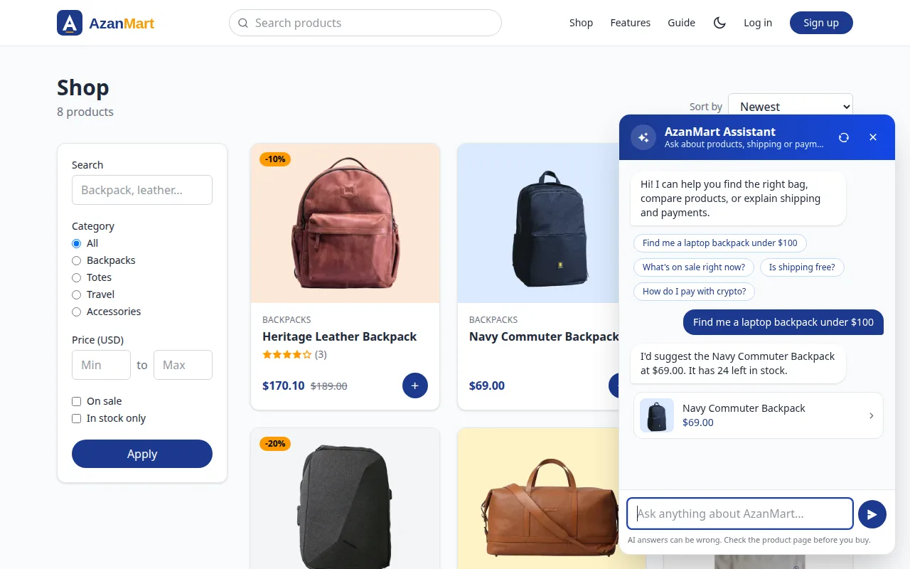
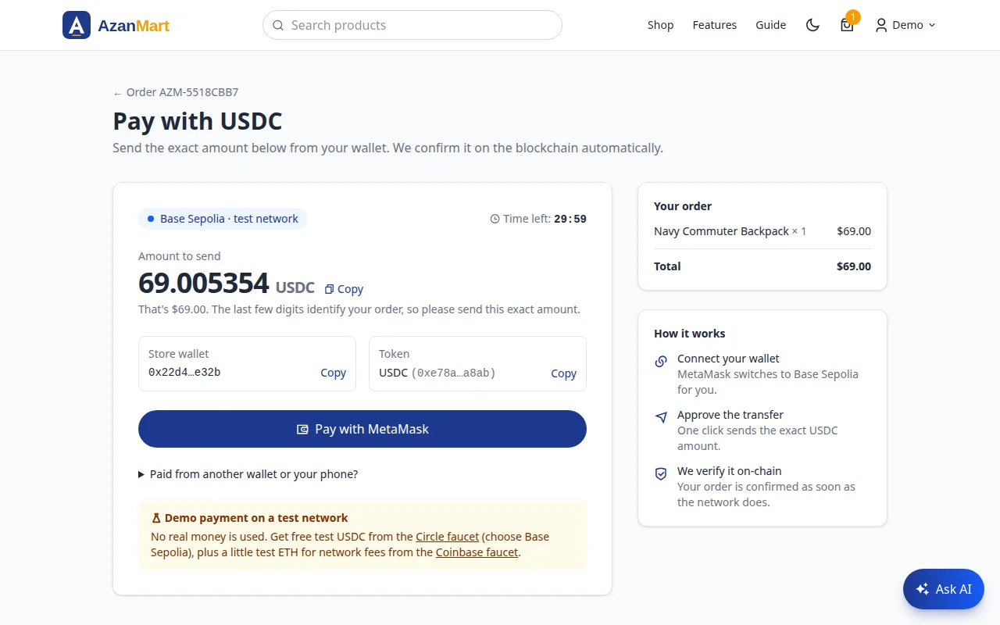

# AzanMart user guide

This guide explains how to use AzanMart, first as a shopper and then as a store admin.
For installing and deploying the app, see the [README](../README.md) and the
[deployment guide](DEPLOYMENT.md).

- [Trying the demo](#trying-the-demo)
- [For shoppers](#for-shoppers)
  - [Browsing and searching](#browsing-and-searching)
  - [Asking the AI assistant](#asking-the-ai-assistant)
  - [Your account](#your-account)
  - [Cart and wishlist](#cart-and-wishlist)
  - [Checking out](#checking-out)
  - [Paying with USDC (crypto)](#paying-with-usdc-crypto)
  - [Orders and emails](#orders-and-emails)
  - [Reviews](#reviews)
- [For store admins](#for-store-admins)
  - [Getting admin access](#getting-admin-access)
  - [The dashboard](#the-dashboard)
  - [Managing products](#managing-products)
  - [Processing orders](#processing-orders)
  - [Managing users](#managing-users)
  - [Moderating reviews](#moderating-reviews)
- [Troubleshooting](#troubleshooting)

---

## Trying the demo

The public AzanMart demo runs payments in **test mode**, so you can buy anything without spending
money. A banner at the top of the page reminds you, and the **Features** page has everything in one
place.

| What               | Use this                                                                                                                                                                     |
| ------------------ | ---------------------------------------------------------------------------------------------------------------------------------------------------------------------------- |
| Demo shopper       | `demo@azanmart.dev` / `Demo@12345`                                                                                                                                           |
| Demo admin         | `admin@azanmart.dev` / `Admin@12345`                                                                                                                                         |
| Test card (Stripe) | `4242 4242 4242 4242`, any future expiry date, any 3-digit CVC, any postcode                                                                                                 |
| Test USDC (crypto) | Free from the [Circle faucet](https://faucet.circle.com) on Base Sepolia, plus test ETH for fees from the [Coinbase faucet](https://portal.cdp.coinbase.com/products/faucet) |
| Cash on delivery   | Nothing to enter                                                                                                                                                             |

The checkout page shows the same details under **Demo payment details**.

---

## For shoppers

### Browsing and searching

You don't need an account to browse. From the home page you can jump into a category or open
**Shop** to see everything.


On the shop page you can:

| To…                 | Do this                                                                                                                                 |
| ------------------- | --------------------------------------------------------------------------------------------------------------------------------------- |
| Search              | Type in the search box (top of every page on larger screens, or in the filters). It matches product names, categories and descriptions. |
| Filter by category  | Pick a category in the filters panel, or click a category on the home page.                                                             |
| Set a price range   | Enter a minimum and/or maximum price in dollars, then **Apply**.                                                                        |
| See only deals      | Tick **On sale**.                                                                                                                       |
| Hide sold-out items | Tick **In stock only**.                                                                                                                 |
| Change the order    | Use **Sort by**: newest, price low→high, price high→low or top rated. When you search, the best matches come first.                     |
| Start over          | Click **Clear**.                                                                                                                        |

On a phone, the filters are folded into a **Filters** panel above the products. Tap it to open it.

Each product card shows the price (with the original price crossed out when it's on sale), its
rating and a **+** button to add it to your cart. Click a product to open its page, where you can
flip through its photos, read the description and reviews, choose a quantity, and see how many are
left when stock is low.

### Asking the AI assistant



Not sure what to buy? Click **Ask AI** in the bottom-right corner of any page and ask in your own
words, for example "a bag for my laptop and gym clothes under $100" or "what's on sale?". The
assistant searches the catalog, reads product details and reviews, and shows the products it
recommends as cards you can click.

- **On a product page**, click **Ask AI about this** and ask about that product: size, materials,
  what reviewers say, or something similar for less.
- Tap one of the **suggested questions** to get started quickly.
- Your conversation stays open while you move between pages. Click the refresh icon to start over.
- The assistant only knows what's in the store, so it won't invent products or prices. It can't
  place orders or see your account. AI answers can still be wrong, so check the product page before
  you buy.
- To keep it fair for everyone, you can ask about 20 questions every 10 minutes.

The assistant only appears when the store owner has set it up.

### Your account

- **Sign up:** click **Sign up** and enter your name, email and a password (at least 6 characters).
  You're logged in straight away, and we email you a **6-digit code** to confirm your address.
- **Verify your email:** type the code on the **Check your email** page. Codes last 10 minutes; if
  one expires or doesn't arrive (check spam), click **send a new code** (once a minute at most). You
  can browse and fill your cart before verifying, but you need a verified email to place an order.
  After 5 wrong codes, ask for a new one.
- **Log in / log out:** use **Log in** in the header. To log out, open the menu under your name and
  choose **Log out**.
- **Forgot your password?** On the login page click **Forgot password?** and enter your email.
  You'll receive a link that lets you choose a new password. The link works once and expires after
  one hour.
- **Account settings:** open the menu under your name and choose **Account**. There you can change
  your name, email and password (you'll need your current password). A new email address has to be
  verified with a code, just like at sign-up.
- **Dark mode:** click the moon or sun icon in the header. AzanMart remembers your choice; until you
  pick one, it follows your device's setting.

### Cart and wishlist


- **Add to cart:** use the **+** button on a product card, or choose a quantity and click
  **Add to cart** on the product page. You need to be logged in; if you aren't, you'll be asked to
  log in first.
- **Change quantities:** on the **Cart** page, change the number next to an item. It updates
  straight away. **Remove** takes the item out.
- **Stock limits:** you can't add more than is in stock. If an item sells out, or its stock drops
  below the amount in your cart, the cart tells you what to fix before you can check out.
- **Shipping:** orders of $50 or more ship free; below that, shipping is $5. The cart shows how much
  more you need for free shipping.
- **Wishlist:** tap the heart on any product to save it for later. Open **Wishlist** from the menu
  under your name to see saved items. Tap the heart again to remove one.

### Checking out


1. From your cart, click **Checkout**.
2. Enter your shipping address. Next time it will be filled in from your last order.
3. Choose how to pay:
   - **Card:** you'll be taken to Stripe's secure payment page. AzanMart never sees your card
     details. When the payment goes through, you come back to your order page. If you cancel,
     your items stay in your cart. An unfinished card payment is released after 30 minutes.
   - **USDC (crypto):** pay from a crypto wallet such as MetaMask. See
     [Paying with USDC](#paying-with-usdc-crypto) below.
   - **Cash on delivery:** pay the courier when your order arrives.
4. Click **Place order**.

The items are reserved for you the moment you place the order, so nobody else can buy the last one
while you're paying.

> The card and USDC options only appear when the store owner has set them up. In the demo, the
> **Demo payment details** box under the payment options shows the test card number
> (`4242 4242 4242 4242`, any future expiry date and any CVC) and where to get test USDC.

### Paying with USDC (crypto)



USDC is a digital dollar: 1 USDC is always worth 1 US dollar. In the demo it runs on **Base
Sepolia**, a free test network, so no real money is involved.

**Before your first payment (demo only):**

1. Install [MetaMask](https://metamask.io) in your browser and create a wallet.
2. Get free test USDC from the [Circle faucet](https://faucet.circle.com) (choose Base Sepolia) and
   a little test ETH to pay network fees from the
   [Coinbase faucet](https://portal.cdp.coinbase.com/products/faucet).

**Paying:**

1. At checkout, choose **USDC (crypto)** and click **Place order**. Your items are reserved and
   the payment page opens.
2. Click **Pay with MetaMask**. MetaMask asks to connect, switches to the right network (or offers
   to add it), and asks you to confirm the transfer. The amount is filled in for you.
3. Wait a few seconds while the network confirms the payment. The page then takes you to your order,
   now marked **Paid**, and you get a confirmation email with a link to the transaction.

**Good to know:**

- **Send the exact amount shown**, for example `69.005354` USDC for a $69.00 order. The extra fraction
  of a cent identifies your order, so a payment can never be confused with someone else's.
- You have **30 minutes** to pay. After that the order is cancelled and the items go back on sale.
- Paid from another wallet or your phone? Open **Paid from another wallet or your phone?** on the
  payment page and paste the transaction hash.
- If you close the page after sending, come back to the order and click **Complete payment**; it
  picks up where you left off.

### Orders and emails


- **My orders** (in the menu under your name) lists every order with its status and total. USDC orders
  link to their transaction on the block explorer. Click one
  to see its items, shipping address, payment details and a **delivery timeline**. Once it ships,
  the timeline shows the courier and tracking number.
- We email you at every step:

  | Email           | When                                                      | What's in it                                                |
  | --------------- | --------------------------------------------------------- | ----------------------------------------------------------- |
  | Order confirmed | You place a cash order, or your card payment goes through | Items, total and delivery address                           |
  | On its way      | The order ships                                           | Courier, tracking number, and the cash amount to have ready |
  | Delivered       | The order arrives                                         | Delivery date, a receipt for cash payments, review links    |
  | Cancelled       | The order is cancelled                                    | Whether you'll be refunded or weren't charged               |

- Order statuses mean:

  | Status     | Meaning                                               |
  | ---------- | ----------------------------------------------------- |
  | Pending    | Waiting for your card or USDC payment to be confirmed |
  | Processing | Confirmed and being prepared                          |
  | Shipped    | On its way to you                                     |
  | Delivered  | Arrived                                               |
  | Cancelled  | Cancelled; any items were returned to stock           |

### Reviews

On a product page, scroll to **Reviews**, pick 1 to 5 stars, optionally add a comment and click
**Post review**. You can review each product once. Posting again updates your review, and you can
delete it at any time. Reviews from people who ordered the product show a **Verified purchase** badge.

---

## For store admins

### Getting admin access

The first admin account is created from the command line:

```bash
npm run create-admin -- you@example.com "a-strong-password" "Your Name"
```

This creates the account, or upgrades an existing one. Log in normally and you'll land on the admin
dashboard. After that, you can make other people admins from **Users**.

If you ran `npm run seed`, the demo admin is `admin@azanmart.dev` / `Admin@12345`.

The admin area is at `/admin`, also reachable from **Admin** in the menu under your name. The sidebar
links to **Dashboard**, **Products**, **Orders**, **Users** and back to the store.

### The dashboard


- **Revenue:** the total of all paid orders. Card orders count once Stripe confirms payment; cash on
  delivery orders count once you mark them delivered.
- **Orders, Customers, Products:** simple counts.
- **Revenue, last 30 days:** daily totals for paid orders. Hover over the line to see a day's figure.
- **Best sellers:** the five products with the most units sold (cancelled orders excluded).
- **Orders by status:** how many orders are at each stage.
- **Recent orders** and **Low stock** (products with 5 or fewer left) link straight to the order or product.

Every chart has a **Show as table** link if you prefer the numbers.

### Managing products

**Products** lists everything in the catalog, newest first, with a search box for product names.

**To add a product,** click **Add product** and fill in:

| Field           | Notes                                                                                                                                                             |
| --------------- | ----------------------------------------------------------------------------------------------------------------------------------------------------------------- |
| Name            | Also used to create the product's web address, e.g. `/products/navy-backpack`. The address doesn't change if you rename the product later, so links keep working. |
| Description     | Shown on the product page and used by search. Line breaks are kept.                                                                                               |
| Category        | Backpacks, Totes, Travel or Accessories.                                                                                                                          |
| Stock           | How many you have. Customers can't order more than this.                                                                                                          |
| Price (USD)     | The full price, at least $0.50.                                                                                                                                   |
| Discount (%)    | 0 to 90. The sale price is worked out for you and shown with the original crossed out.                                                                            |
| Images          | 1 to 4 JPEG, PNG, WebP or GIF files, up to 2 MB each. They're resized and converted to WebP automatically. The first image is the main one.                       |
| Card background | The colour behind the product photo on cards and the product page.                                                                                                |

**To edit a product,** click **Edit**. Leave the image field empty to keep the current photos;
uploading new ones replaces all of them.

**To delete a product,** click **Delete** and confirm. It's removed from shoppers' carts and
wishlists. Past orders keep their own copy of the name and price, so order history isn't affected.

### Processing orders


**Orders** lists all orders, newest first. Filter by status or search by order number (with or
without the `AZM-` prefix). Click an order to see its items, customer, address and payment.

Use **Update status** on the order page to move it along. When you mark an order as **Shipped**,
fill in the **courier** (common ones are suggested as you type) and the **tracking number**. They're
shown to the customer on their order page and included in the shipping email.

| Change to  | What happens                                                                                                                                 |
| ---------- | -------------------------------------------------------------------------------------------------------------------------------------------- |
| Processing | Marks the order as being prepared.                                                                                                           |
| Shipped    | Emails the customer that their order is on its way.                                                                                          |
| Delivered  | Final. For cash on delivery, the order is also marked as paid.                                                                               |
| Cancelled  | Final. Emails the customer and puts the items back into stock. For a card order that was already paid, refund it from your Stripe dashboard. |

Delivered and cancelled orders can't be changed again.

Card and USDC orders you see as **Pending** are waiting for payment. They become **Processing**
automatically when payment is confirmed (by Stripe, or on the blockchain for USDC), or **Cancelled**
(with stock returned) if the customer doesn't pay within 30 minutes. For USDC orders the order page
shows the paying wallet and a link to the transaction.

### Managing users

**Users** lists every account with the number of orders and total spent (cancelled orders
excluded). Search by name or email. Use the **Role** menu to make someone an admin or turn them back
into a customer. The change takes effect on their next click. You can't change your own role, so you
can't lock yourself out by accident.

### Moderating reviews

Admins see a **Remove (admin)** link under each review on product pages. Removing a review updates the
product's average rating straight away.

---

## Troubleshooting

**"This form has expired. Please refresh the page and try again."**
Forms carry a security token tied to your session. If you left a page open for a long time, or logged
in or out in another tab, refresh the page and submit again.

**"Too many attempts. Please wait 15 minutes and try again."**
Logins, sign-ups and password resets are limited to 10 tries per 15 minutes to stop password guessing.

**I didn't get an email or verification code.**
Check your spam folder, then use **send a new code** on the verification page. If nobody is getting
emails, check the server log at startup: it says whether it could log in to Gmail (see
[Send email with Gmail](DEPLOYMENT.md#5-send-email-with-gmail)). On a development setup without SMTP
settings, emails aren't sent; the log prints the path of an HTML copy of each email instead.

**The card or USDC payment option is missing.**
The store owner hasn't set them up yet (`STRIPE_SECRET_KEY` for cards, `CRYPTO_RECEIVER_ADDRESS` for
USDC). Cash on delivery still works.

**MetaMask says I don't have enough funds, or the payment fails.**
You need both test USDC (the payment) and a little test ETH (the network fee) on Base Sepolia. Get them
from the faucets listed in [Trying the demo](#trying-the-demo), then try again.

**My USDC payment is taking a long time.**
The page keeps checking for a few minutes. If it gives up, your payment is safe: reload the order page
later, or paste the transaction hash under **Paid from another wallet or your phone?**. If the
30-minute window closed before it confirmed, contact the store with the transaction hash.

**The AI assistant says it's busy or unavailable.**
You may have asked a lot of questions in a short time; wait a few minutes. If it never answers, the
store owner hasn't set `ANTHROPIC_API_KEY`, or the service is temporarily down. Search and filters
always work.

**An item disappeared from my cart.**
The product was removed from the store. Your past orders are not affected.
